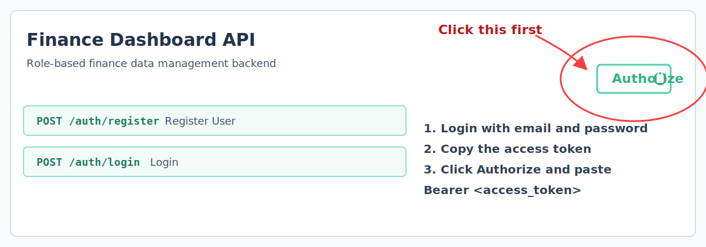

# Finance Dashboard API

## 1. Project Overview

This project is a production-oriented FastAPI backend for a Finance Dashboard system. It includes JWT authentication, role-based access control, financial record management with soft deletion, dashboard analytics endpoints, Alembic migrations, and an idempotent seed script for quick local setup.

## 2. Tech Stack

| Component | Technology |
| --- | --- |
| Language | Python 3.11+ |
| API framework | FastAPI |
| ASGI server | Uvicorn |
| ORM | SQLAlchemy 2.x |
| Database | SQLite |
| Migrations | Alembic |
| Validation | Pydantic v2 |
| Authentication | JWT with `python-jose` |
| Password hashing | `passlib[bcrypt]` |
| Dependency management | Poetry |

## 3. Setup Instructions

1. Clone the repository and move into the backend directory.
2. Install dependencies with Poetry:

   ```powershell
   poetry install
   ```

3. Create a local environment file from the example:

   ```powershell
   Copy-Item .env.example .env
   ```

4. Apply database migrations:

   ```powershell
   poetry run alembic upgrade head
   ```

5. Seed the database:

   ```powershell
   poetry run python -m app.seed
   ```

6. Start the API server:

   ```powershell
   poetry run uvicorn app.main:app --reload
   ```

## 4. How to Run

Use:

```powershell
poetry run uvicorn app.main:app --reload
```

## 5. Swagger UI

Swagger UI is available at [http://localhost:8000/docs](http://localhost:8000/docs).

### Accessing Protected Routes in Swagger

To use protected endpoints such as `/users`, `/records`, and `/dashboard/*` from Swagger UI:

1. Open [http://localhost:8000/docs](http://localhost:8000/docs).
2. Call `POST /auth/login` with only your email and password or use existing/given admin credentials.
3. Click the `Authorize` button at the top-right of Swagger UI.
4. Then add Email and password in authorize in section and enter.
6. Call any protected route.



### Swagger Login Notes

- For `POST /auth/login`, only `username` and `password` are needed.
- Enter your email in the `username` field because Swagger uses the OAuth2 form field name `username`.
- Set `grant_type` to `password` if Swagger asks for it.
- Leave `scope`, `client_id`, and `client_secret` empty.
- Use an admin login such as `admin@finance.com / Admin1234` to access admin-only routes like `/users`.

## 6. Seed Credentials

| Email | Password | Role |
| --- | --- | --- |
| admin@finance.com | Admin1234 | admin |
| analyst@finance.com | Analyst1234 | analyst |
| viewer@finance.com | Viewer1234 | viewer |

## 7. API Endpoints Reference

| Method | Path | Role required | Description |
| --- | --- | --- | --- |
| POST | `/auth/register` | Public | Register a new user |
| POST | `/auth/login` | Public | Obtain a bearer token |
| GET | `/users` | admin | List users with pagination |
| GET | `/users/{id}` | admin | Get one user |
| POST | `/users` | admin | Create a user |
| PUT | `/users/{id}` | admin | Update full name, role, or active state |
| DELETE | `/users/{id}` | admin | Hard delete a user, except self |
| GET | `/records` | viewer, analyst, admin | List records with filtering and pagination |
| GET | `/records/{id}` | viewer, analyst, admin | Get one record |
| POST | `/records` | analyst, admin | Create a record |
| PUT | `/records/{id}` | analyst, admin | Update a record |
| DELETE | `/records/{id}` | admin | Soft delete a record |
| GET | `/dashboard/summary` | viewer, analyst, admin | Get totals for income, expenses, net balance, and count |
| GET | `/dashboard/categories` | viewer, analyst, admin | Get category totals and counts |
| GET | `/dashboard/trends` | viewer, analyst, admin | Get weekly or monthly trend aggregates |
| GET | `/dashboard/recent` | viewer, analyst, admin | Get most recent non-deleted records |

## 8. Role Permissions Matrix

| Capability | viewer | analyst | admin |
| --- | --- | --- | --- |
| View records | Yes | Yes | Yes |
| Create records | No | Yes | Yes |
| Update records | No | Yes | Yes |
| Soft delete records | No | No | Yes |
| View dashboard | Yes | Yes | Yes |
| Manage users | No | No | Yes |

## 9. Assumptions Made

- User registration is intentionally open to any role for local development and testing, as requested.
- `created_by` on financial records is nullable with `ON DELETE SET NULL` so admin user deletion can remain a true hard delete without removing historical records.
- The dashboard trends endpoint returns the last 12 weekly or monthly buckets, including zero-value buckets where no records exist.
- Category filtering uses exact string matches rather than partial search to keep the API predictable.

## 10. Tradeoffs Considered

- SQLite keeps setup simple and portable, but it is not ideal for high-concurrency production workloads compared with PostgreSQL.
- Services use a synchronous SQLAlchemy session for clarity and compatibility with SQLite, while route handlers remain `async` as required.
- The app initializes tables on startup with `create_all()` for convenience, even though Alembic is also included for explicit schema migration workflows.
- `requirements.txt` is provided to match the requested deliverables, but Poetry is the intended dependency manager for installation and execution.
